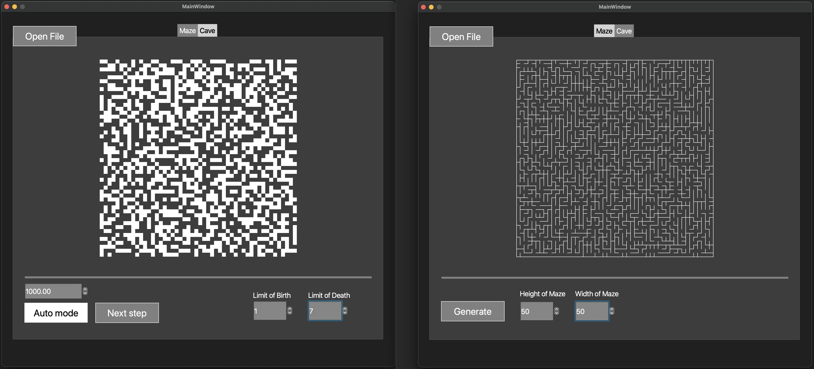

# Maze

In this project I implemented mazes and caves, including the basic algorithms of their handling, such as: generation, rendering, solving.




## Information

A maze with "thin walls" is a table of _n_ rows by _m_ columns size. There may be "walls" between the cells of a table. The table as a whole is also surrounded by "walls".

The solution to a maze is the shortest path from a given starting point (table cell) to the ending one.
When traversing a maze, you can move to neighboring cells that are not separated by a "wall" from the current cell and that are on the top, bottom, right or left.
A route is considered the shortest if it passes through the smallest number of cells.

## Maze description

The maze can be stored in a file as a number of rows and columns, as well as two matrices containing the positions of vertical and horizontal walls respectively.

The first matrix shows the wall to the right of each cell, and the second - the wall at the bottom.

An example of such a file:
```
4 4
0 0 0 1
1 0 1 1
0 1 0 1
0 0 0 1

1 0 1 0
0 0 1 0
1 1 0 1
1 1 1 1
```
## Caves description

A cave that has passed 0 simulation steps (only initialized) can be stored in the file as a number of rows and columns, as well as a matrix containing the positions of "live" and "dead" cells.

An example of such a file:
```
4 4
0 1 0 1
1 0 0 1
0 1 0 0
0 0 1 1
```

## 1. Implementation of the Maze

- The program developed in C++ language of C++17 standard
- The program code located in the src folder
- Writing code follows the Google style
- The program built with Makefile which contains standard set of targets for GNU-programs: all, install (on Desctop), uninstall, clean, dvi, dist, tests
- GUI implementation, based on GUI library with API for C++17: Qt
- The program has a button to load the maze from a file, which is set in the format described
- Maximum size of the maze is 50x50
- The loaded maze rendered on the screen in a field of 500 x 500 pixels
- "Wall" thickness is 1 pixel
- The size of the maze cells themselves is calculated so that the maze occupies the entire field allotted to it.

- Using **Eller's algorithm** for generating
- The generated maze doesn't have isolations and loops
- Prepared full coverage of the perfect maze generation module with unit-tests
- The user enters only the dimensionality of the maze: the number of rows and columns
- The generated maze saved in the file format described

## 2. Solving the maze

- The user sets the starting **(left mouse button)** and ending **(right mouse button)** points
- The route, which is the solution, displayed with a line 1 pixel thick, passing through the middle of all the cells in the maze through which the solution runs.
- The color of the solution line is red

## 3. Cave Generation

- The user selects the file that describes the cave according to the format described
- Used a separate window or tab in the user interface to display the caves
- Maximum size of the cave is 50 x 50
- The loaded cave rendered on the screen in a field of 500 x 500 pixels
- The user sets the limits for "birth" and "death" of a cell, as well as the chance for the starting initialization of the cell
- The "birth" and "death" limits can have values from 0 to 7
- There a step-by-step mode for rendering the results of the algorithm in two variants:
    - Pressing the next step button will lead to rendering the next iteration of the algorithm
    - Pressing the automatic work button starts rendering iterations of the algorithm with a frequency of 1 step in `N` milliseconds, where the number of milliseconds `N` is set through a special field in the user interface
- The size of cells in pixels is calculated so that the cave occupies the entire field allotted to it
- Prepared full coverage of the cave generation module with unit-tests
